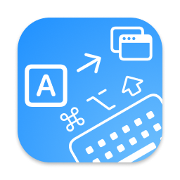

# KeyPhantom

  

  <strong>Send keyboard events silently to background applications</strong>

## Overview

KeyPhantom is a macOS utility that lets you create keyboard shortcuts that send specific keystrokes to background applications - like a phantom operating behind the scenes. Perfect for power users who need to control multiple applications simultaneously without switching contexts.

## Key Features

- **Custom Keyboard Shortcuts**: Create global shortcuts that trigger specific key presses in target applications
- **Application Targeting**: Send keystrokes to specific applications without bringing them to the foreground
- **Menu Bar Control**: Quick access to enable/disable functionality from the status menu
- **Easy-to-Use Interface**: Simple settings panel for managing your phantom key bindings
- **Launch at Login**: Option to start automatically when you log in
- **Automatic Updates**: Stay current with the latest features and improvements

## Requirements

- macOS 13.5 or later
- Accessibility permissions (required to send keystrokes to applications)

## Installation

1. Download the latest release from the [Releases](https://github.com/situ2001/keyphantom/releases) page
2. Move KeyPhantom to your Applications folder
3. Launch KeyPhantom and follow the onscreen instructions to grant Accessibility permissions

## Usage

1. Click the keyboard icon in your menu bar to access KeyPhantom
2. Open Settings to configure your phantom key bindings
3. Create a new binding by:
   - Setting a global shortcut
   - Choosing the key to be sent
   - Selecting the target application
4. Enable KeyPhantom using the toggle in menu or in the settings panel

## Planned Features

KeyPhantom currently supports sending single keyboard events to background applications, but the architecture is designed to support more functionality in the future:

- **Modifier Key Support**: Send complex key combinations with modifier keys
- **Scroll Wheel Events**: Control scrolling in background applications

## Privacy

KeyPhantom requires accessibility permissions to function but does not record or transmit your keystrokes. All operations happen locally on your Mac.

## Support

If you encounter any issues or have questions, please file an issue in the [GitHub repository](https://github.com/situ2001/keyphantom/issues).

## License

Copyright © 2025 situ2001. All rights reserved.